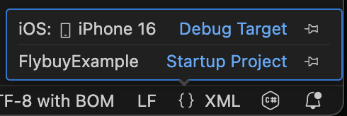
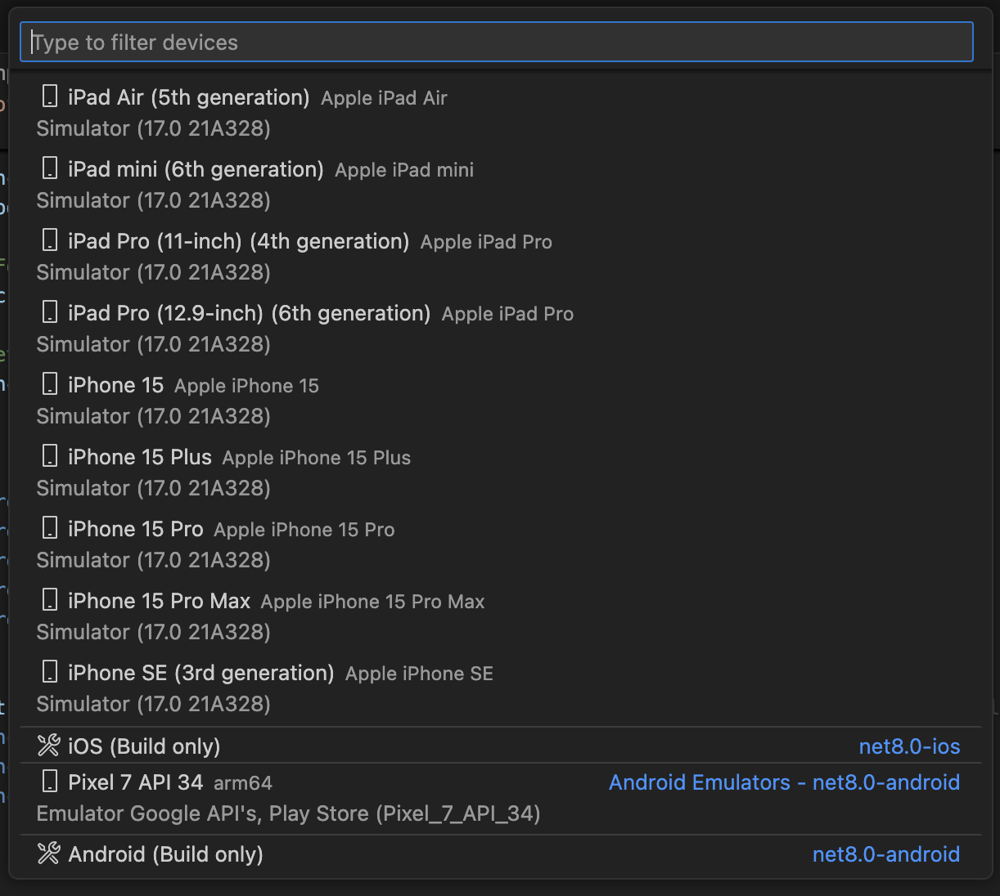
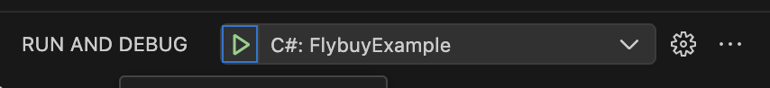

# Flybuy MAUI Example
Flybuy example app using .Net MAUI and Flybuy SDK bindings

## Installation

Follow instructions at
https://learn.microsoft.com/en-us/dotnet/maui/get-started/installation?view=net-maui-9.0&tabs=visual-studio-code.

### Android setup

Run the following in the project folder. Note currently using .NET8.0

```
dotnet build -t:InstallAndroidDependencies -f:net8.0-android -p:AndroidSdkDirectory="<AndroidSdkPath>" -p:JavaSdkDirectory="<JavaSdkPath>" -p:AcceptAndroidSDKLicenses=True
```

## Running the app via VSCode

1. Select the debug target in VSCode by clicking the `{}` in the lower right, then selecting the target.





2. Open the Run and Debug view.
3. Select `C# FlybuyExample`.
4. Click the `Run` button.


